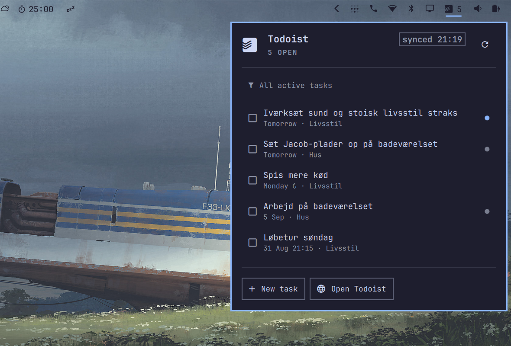

# Omadoist



**Todoist in your Omarchy bar.** The open-task count sits next to the Todoist
mark; click it for a panel that lists your tasks, ticks them off in place, adds
new ones, and switches filters — all keyboard-driven and themed like the rest
of the shell. The same list lives under **Todoist** in the Omarchy menu.

## What you get

- Open-task count in the bar, in the urgent colour when something is overdue.
- A panel with your tasks: due date, project, priority; `Enter` completes.
- Inline **New task** (`n`) with a searchable project picker, and **Filter**
  (`f`); the whole Todoist filter language works, with a plain-language "did
  you mean …" when it doesn't.
- The list under **Todoist** in the Omarchy menu, so `Super+Space` → "todo"
  finds it too.
- A five-minute background sync, and notifications only for tasks added or
  completed *somewhere else* — never for what you just did here.
- Your API token stays in a mode-600 file; the widget itself never sees it.

## Install

```bash
omarchy plugin add https://github.com/rastermanden/omadoist.git --enable --yes
```

Then click the checkbox in the bar and choose **Set up Todoist…**. That runs
`omadoist setup` in a terminal: it installs the icon font, the sync timer,
the menu rows and a launcher on your PATH. Then choose **Connect Todoist…** and paste the token from
[Todoist → Settings → Integrations → Developer](https://app.todoist.com/app/settings/integrations/developer).

Requires Omarchy 4+ and [bun](https://bun.sh) (`omarchy pkg add bun`).

From a checkout instead:

```bash
./install.sh          # copies a clean tree into ~/.config/omarchy/plugins/omadoist and runs setup
./uninstall.sh        # removes timer, font, menu rows, launcher and the plugin; keeps your token
```

Update a published install with `omarchy plugin update omadoist`. Remove it
with `omadoist uninstall && omarchy plugin remove omadoist` — that keeps
your token and config for a later reinstall; `omadoist uninstall --purge`
removes those too.

## Using it

| Where | Does |
| --- | --- |
| Bar glyph, left click | open / close the panel |
| Bar glyph, right click | open the panel straight into **New task** |
| Bar glyph, middle click | re-sync |
| Row, click / `Enter` / `Space` | complete the task |
| Row, right click | open the task in Todoist |
| `j` `k` / arrows | move the cursor |
| `n` | new task, in Quick Add syntax (`Tab` picks the project, `Enter` adds, `Esc` cancels) |
| click a filter chip | switch to a saved filter |
| `f` (or click the filter line) | type any other Todoist filter; empty = all tasks |
| `r` | re-sync |
| `o` | open Todoist |
| `u` | undo the last completion |
| `Tab` / `Esc` | next panel / close |

A row shows its title, `due · project` and a priority dot, and nothing else:
the list stays quiet. Move the cursor onto one — `j`/`k` or the mouse — and its
description and labels appear under the list, so the rest of the rows do not
move while you read.

A completed row stays ticked and struck through until the next sync drops it,
and a strip under the list then offers **Undo** (or `u`) for twelve seconds —
a whole row completes on a plain left click, so a mis-click is easy. From a
terminal, `omadoist undo` puts back the last task completed on this machine and
`omadoist reopen <task-id>` puts back any task by id.

Completing a *recurring* task moves it to its next due date rather than closing
it — the row stays ticked for a moment showing where it went — so there is
nothing to reopen: no Undo is offered for those, and `omadoist undo` says why
instead of doing something surprising.

When a sync does not land — no network, Todoist down, a token that has been
revoked — the rows stay put and the panel says why, with the time they were
last fetched. A rejected token gets a **Reconnect Todoist…** button, since
that is the one case waiting does not fix. If the five-minute timer simply
stops running, the panel says so once the list is three runs old.
`omadoist status` prints the same reason.

Keyboard shortcut — add to `~/.config/hypr/bindings.lua` (`SUPER+CTRL+T` is
Omarchy's own Activity binding, so the ALT layer):

```lua
o.bind("SUPER + ALT + T", "Todoist", "omarchy-shell shell toggle omadoist")
```

Scriptable over shell IPC: `omarchy-shell omadoist refresh|add|filter|toggle`.

### New tasks

Titles go through Todoist's own Quick Add parser, the same one the web and
mobile composers use, so the whole thing can be one line:

```bash
omadoist add "sæt plader op tomorrow p1 #Hus @gør-det-selv // husk skruerne"
```

Dates (`tomorrow at 17`, `next monday`), priorities (`p1`…`p4`), `#Project`,
`/Section`, `@label`, deadlines in `{braces}`, reminders (`!30m`) and a
`// description` at the end are all lifted out of the title. Anything it
cannot parse simply stays in the title, so a plain sentence is still a task.

`n` in the panel opens the title field with a project picker under it, set to
your Inbox. `Tab` opens the picker, typing searches it; the choice sticks
for as long as the panel stays open, so a run of tasks can go to one project.
The **New task…** menu row asks for the title and then the project through the
Omarchy menu — unless the title already names one. From a terminal it is a
flag:

```bash
omadoist add --project Hus "Sæt de sidste plader op"
```

`--project` takes a project name, a `#Name`, an unambiguous start of one
(`--project hus`), or the id the panel passes. An account with nothing but an
Inbox is never asked the question. A `#Project` typed into the title wins over
both the flag and the picker: the picker always has something selected, and
what you typed is the more deliberate of the two.

### Filters

Any [Todoist filter query](https://todoist.com/help/articles/introduction-to-filters):
`today | overdue`, `next 7 days & #Work`, `p1 | (p2 & next 7 days)`, `no date`,
`search: milk`, `@errand`, `!subtask` …

The ones you switch between live in `config.json` under `filters`, as a row of
chips above the task list and as menu rows, with the one in force marked.
A fresh install gets **Today**, **Overdue** and **All**; edit the list to keep
your own — `{ "name": "p1", "query": "p1" }` for the urgent ones,
`{ "name": "Work", "query": "#Work" }` for a project, and so on. A single chip is no choice at all, so the row hides itself
until there are two.

Anything else is typed: `f` in the panel or a click on the filter line, the
**Filter…** menu row, or `omadoist filter "today | overdue"` (`--clear`, or
`all`, for none). A saved chip takes the same route, so a preset is checked
against Todoist before it lands and cannot leave the five-minute timer failing.
Every route checks the query with Todoist before saving it, and a refused one comes
back in words with a fix one click away: `todya | overdeu` → *Did you mean
“today | overdue”?*, `today or overdue` → `today | overdue`, `#Livstil` →
`#Livsstil`. A project or label that doesn't exist gets a nudge too, since
Todoist accepts it and simply matches nothing. Setting a filter is otherwise
silent — you just set it, and the panel and the menu both show what it is —
and it never triggers a "remote changes" notification.

### Notifications

`omadoist sync` diffs each fetch against the previous one. Tasks that
appeared or vanished without this machine doing it produce one notification —
*Todoist · 2 new, 1 done* with the titles. Completing or adding a task here is
silent, and so is setting a filter; failures always notify, and so does a
filter Todoist accepts but that matches nothing. Turn it off with `"notifyRemoteChanges": false`
in `~/.config/omadoist/config.json`. Caveat: with a date-based filter, a task
that stops matching looks like "done" to the diff.

## Settings

Bar-widget settings live on the layout entry in `~/.config/omarchy/shell.json`
(`omarchy bar set omadoist <key> <value>`, or Setup → Plugins):

| Key | Default | Meaning |
| --- | --- | --- |
| `showCount` | `true` | open-task count next to the glyph |
| `hideWhenEmpty` | `false` | hide the widget when nothing is open |
| `icon` | `` | glyph; any Nerd Font glyph once `iconFont` is cleared |
| `iconFont` | `Omadoist Icons` | font the glyph is drawn with; empty = bar font |
| `command` | `bin/omadoist` in the plugin | the launcher the panel shells out to |

`~/.config/omadoist/config.json` (all optional):

```json
{
  "filter": "today | overdue",
  "limit": 25,
  "filters": [
    { "name": "Today", "query": "today" },
    { "name": "Overdue", "query": "overdue" },
    { "name": "All", "query": "" }
  ],
  "showDetails": true,
  "showTaskDetails": true,
  "notifyRemoteChanges": true,
  "menuLabel": "Todoist",
  "menuIcon": "󰄲",
  "menuIconFont": ""
}
```

`limit` caps the rows in the menu and the panel (sorted overdue → today →
later, then priority); the bar count is however many tasks the last sync
fetched — pages of 200 until it holds at least four times `limit` — so an
account with hundreds of matching tasks counts low, and so does the "N more in
Todoist" line under the list. `showDetails` adds the `due · project` subtitle
in the menu. `showTaskDetails` is the other one: the task's own description and
labels, under the list for the row the cursor is on — off keeps them out of
`bar.json` altogether. `filters` are the saved queries above the list, up to
twelve; a malformed entry is skipped with a line on stderr rather than costing
the rest, `"query": ""` (or `"all"`) is the all-tasks preset, and `[]` hides
the chip row. `menuLabel`, `menuIcon` and `menuIconFont` are the **Todoist** row
in the Omarchy menu; the glyph defaults to the Todoist mark, which exists only
in the `Omadoist Icons` font `setup` installs, so any other glyph — the Nerd
Font checkbox above, say — needs `menuIconFont` emptied to fall back to the
shell font. Change the sync interval in
`~/.config/systemd/user/omadoist-sync.timer` (`OnUnitActiveSec=`), then
`systemctl --user daemon-reload && systemctl --user restart omadoist-sync.timer`.

## Commands

| Command | What it does |
| --- | --- |
| `omadoist setup` / `uninstall [--purge]` | Install / remove the font, timer, menu rows, launcher and cache; `--purge` also removes token and config |
| `omadoist auth [token]` | Store the API token (mode 600) and sync |
| `omadoist sync [--open]` | Fetch tasks, rewrite the menu block and the bar view |
| `omadoist done <task-id>` | Complete a task and re-sync |
| `omadoist undo` | Put back the last task completed on this machine |
| `omadoist reopen <task-id>` | Put back a task by id |
| `omadoist add [--project <name>] [text…]` | Add a task, parsing Quick Add syntax (`tomorrow`, `p1`, `#Project`, `@label`); with no text it prompts through the menu |
| `omadoist filter [query]` | Show or set the filter (`--clear`, `--edit`) |
| `omadoist list` / `status` | Print the cached tasks / where everything is |
| `omadoist menu` | Rewrite the menu block and bar view from cache only |
| `omadoist unlink-menu` | Remove the generated menu block |

## How it works

`omadoist sync` (systemd user timer, every five minutes) fetches your tasks
and writes two things: a generated block between `// >>> omadoist:begin` and
`// <<< omadoist:end` in `~/.config/omarchy/extensions/omarchy-menu.jsonc`
(the only way to extend the menu; everything outside the markers is yours),
and `~/.cache/omadoist/bar.json`, a pre-sorted, pre-formatted view of the
same tasks. `Panel.qml` watches that file and shells out to the bundled CLI
for every action, so the menu, the bar and the terminal can never disagree,
and the QML never touches the network or the token.

The Todoist mark ships as a one-glyph font (`assets/omadoist-icons.ttf`,
built from the CC0 simple-icons SVG with `bun run build:font`) because both
the menu and the bar draw icons as text. The bar loads it straight from the
plugin folder; the menu needs the copy `setup` installs, which the shell picks
up on its next restart.

| Path | Purpose |
| --- | --- |
| `~/.config/omarchy/plugins/omadoist/` | the plugin (this repository) |
| `~/.config/omarchy/shell.json` | one `{"id":"omadoist"}` entry in the bar layout |
| `~/.config/omarchy/extensions/omarchy-menu.jsonc` | the generated block only |
| `~/.config/omadoist/` | token (mode 600) + config |
| `~/.cache/omadoist/` | `tasks.json`, `bar.json` |
| `~/.config/systemd/user/omadoist-sync.{service,timer}` | background sync |
| `~/.local/share/fonts/omadoist-icons.ttf` | the Todoist mark |
| `~/.local/bin/omadoist` | launcher, for the terminal |

`TODOIST_API_TOKEN` in the environment overrides the token file. Plugins run
unsandboxed inside `omarchy-shell`; read the code before enabling it.

## Development

```bash
bun install                 # only for tests, tsc and the font build
bun test                    # CLI logic, sync diff, filter diagnosis, plugin/Model.js
bunx tsc --noEmit
```

`Panel.qml` is the bar widget and its popup; `Model.js` is the Qt-free logic it
leans on. `omarchy plugin validate .` refuses a tree with `node_modules` in it
(symlinks), so validate a clean copy — `./install.sh` does — or a fresh clone.
Note that the shell hot-reloads a changed plugin but may keep serving the
previously compiled QML; after QML edits run `omarchy restart shell` and check
`qs log --pid $(pgrep -f 'quickshell -n -p') -t 200` for errors.

## License

MIT — see [LICENSE](LICENSE). The Todoist name and logo are trademarks of
Doist; this project is not affiliated with or endorsed by Doist.
